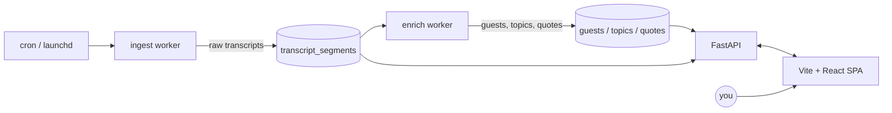

> **Prerequisites.** This series assumes you've read [*uv: the 2026 Python toolchain*](/uv-2026/why-uv-exists/) for the toolchain and [*Python Monorepos in 2026*](/python-monorepo-2026/) for the repo layout. Each post stands alone if you skim those — but the `uv sync` + workspace mental model is the floor we build on.

There's a podcast channel I keep going back to — [@TheDoersglobal](https://www.youtube.com/@TheDoersglobal) on YouTube — long-form conversations with founders and operators. (I'll call it *our reference channel* from here on; the tool is dataset-agnostic, swap your own in.)

Three things kept frustrating me:

1. **I couldn't search inside episodes.** I remembered a specific 90-second exchange about fundraising in Nepal. I could not, for the life of me, find which episode it was in.
2. **Guests blurred together.** Some had appeared three or four times across the channel's run. Each appearance felt like the first one — no way to see "what did this person say last year that they're walking back now?"
3. **Repeat-guest interviews felt generic.** The host had to ask "origin story" questions to re-orient the audience, even when half the listeners already knew this person.

So this is what we're going to build, over the next eight posts: a locally-running tool that fixes all three. Call it **AI Podcast Index**. By the end of this post you'll know exactly what the artifact does, what's in the stack, and what's deliberately *not* in scope.

---

## What you'll have at the end

Open `localhost:5173`. The first page is a grid of the channel's most-appeared guests, faces and names, ranked by appearances and recency. Click any of them and you land on their dedicated page:

- Every episode they've appeared in, with deep-links into the exact YouTube timestamp.
- Topics they've covered across appearances.
- A handful of quotable lines we've pulled from their transcripts.
- A button: **Generate questions for return episode**.

Now flip to the search tab. Type *"fundraising in Nepal"* — not a keyword, an *intent*. You get back eight clips. Each clip is a 30–60 second window: title, guest, the surrounding sentence, and a button that opens YouTube at the exact second the clip starts. Click one. YouTube opens at 12:43. The person says the thing you remembered. The whole flow — from intent in your head to the right second of a one-hour video — takes about four seconds.

Now click the **Generate questions** button on a guest's page. Loading state for a few seconds. Out comes a markdown list of ten follow-up questions, each one *grounded in something the guest has already said on the channel*. Not "what's your origin story?" — those are banned. Each question hovers a tooltip showing the prior quote it's built on: *"In episode 47 you said X, but in episode 92 you said Y — which is it now?"*

That's the artifact. Local-first. Single-user. No deploy. Five-minute setup if you have Postgres running.

---

## The architecture, on one screen



Two background workers, one database, one API, one SPA. Six boxes. Each post in this series builds one or two of them.

- **Posts 2–4** build the left half: ingest, transcript storage, structured extraction with Claude, entity resolution for guests.
- **Posts 5–6** make Claude calls cheap (provider-switching, tier routing) and make search fast (Postgres FTS + LLM rerank).
- **Posts 7–8** build the React side and the capstone question generator, then wrap it all in a cron so it runs without you.

---

## The stack, one paragraph per choice

I'll keep this honest. For each piece there's a why and a *why-not-X*. If you disagree with a choice, swap it — the architecture survives.

### `uv` workspaces (vs Poetry, vs raw venv)

The whole repo is a single `uv` workspace. Three Python packages (`ingest`, `enrich`, `api`) plus a shared schema package, all in one tree, one lockfile, one `uv sync`. Poetry would work, but it's slower and the workspace ergonomics are weaker — I covered the head-to-head in [*uv vs the old stack*](/uv-2026/uv-vs-the-old-stack/). Raw venv per-package would mean four lockfiles drifting apart. With `uv` workspaces, when `shared-schema` changes its `BaseModel`, both `enrich` and `api` rebuild against the same version. That's the whole point.

### FastAPI (vs Flask, vs Django)

The API is small — fewer than ten routes — and every one of them returns JSON to a typed React client. FastAPI gives us Pydantic models in and out for free, async by default (we'll need it when we're streaming LLM calls into responses), and an OpenAPI schema we can codegen TypeScript types from in post 7. Flask works but you bolt all of that on. Django brings an ORM and an admin we won't use, and a class-based view system that wouldn't earn its keep here.

### Postgres + `tsvector` (vs SQLite, vs Elasticsearch, vs a vector DB)

Postgres for storage, Postgres `tsvector` for full-text search. SQLite would work for storage but its FTS extension is weaker and we'd outgrow it the moment we add a second worker process. Elasticsearch is operational overhead we don't need at this corpus size — hundreds of episodes, not millions. A vector DB (pgvector, Qdrant, Pinecone) is the move *if* full-text search isn't precise enough — and post 6 will show why, at this scale, it is. We get one database, one connection pool, one backup strategy. The "when to add embeddings" hook is left dangling for a sequel.

### Vite + React SPA (vs Next.js)

The frontend has three pages: home, guest detail, search. There's no SEO consideration — it's a local tool. There's no streaming-from-server requirement that would make SSR pay off. Next.js would add an app-router mental model and a build step we don't need. Vite gives us hot reload, TypeScript, and a dev proxy to FastAPI in fifteen lines of config. We'll spend the saved complexity on the parts that actually matter — entity resolution, search rerank, the question prompt.

### Anthropic SDK + provider-switchable wrapper (vs LangChain)

Every LLM call goes through one function: `complete(system=..., messages=..., schema=..., tier=...)`. Behind it sits an `anthropic_adapter.py` by default, with `openai_adapter.py` and `ollama_adapter.py` selectable via env var. Sixty lines of glue, total — post 5 walks through every line. LangChain would give us the same surface area, but with eight layers of abstraction between us and the actual API call. When something goes wrong (and it will — prompts are software), you want a stack trace that fits on a screen. The wrapper also lets us route cheap classification work to Haiku and synthesis to Opus through one keyword argument. That `tier="cheap" | "smart"` argument is doing a *lot* of work later in the series.

### `yt-dlp` + Whisper as fallback to the YouTube Data API

This is the only stack choice with a real ethical knot, and I want to put it up top. **The primary path is YouTube Data API v3** — Google's official, TOS-blessed way to list a channel's uploads and fetch auto-captions. We register an API key, we respect the daily quota, we behave. **`yt-dlp` + local Whisper is a fallback for episodes whose auto-captions are missing**. `yt-dlp` audio extraction technically violates YouTube's TOS, and pretending otherwise is dishonest. We use it sparingly, locally, on content from a single channel we have a personal relationship with — never as a primary scrape, never at scale, never to redistribute audio. Post 2 covers the compliance call in more depth and shows the API-first path first.

---

## What's *not* in scope

Saying yes to a list is easy. The harder list is the no's:

- **No auth.** Single-user, your laptop. There is no `users` table.
- **No hosting.** You'll run it on `localhost`. There is no `Dockerfile` for production, no Terraform, no domain.
- **No multi-tenant.** One channel at a time, configured by env var.
- **No real-time.** A new episode shows up after the cron runs at 03:00, not the moment YouTube publishes it.
- **No mobile.** Desktop browser. The Vite SPA is responsive enough to look reasonable on a phone, but the workflow assumes a keyboard.
- **No embeddings.** Post 6 will defend this in detail. Short version: at hundreds of episodes, `tsvector` + a Claude rerank pass outperforms a half-built RAG stack.

These aren't oversights — they're the line between *teaching artifact* and *product*. The final post hints at what a sequel-series would tackle (multi-channel, auth, hosting, embeddings) without committing to write it.

---

## First run

The whole project ships as a single `uv` workspace. Once the repo is public, the first run will look like this (Postgres assumed running locally — `brew services start postgresql@16` or your distro's equivalent):

```sh
git clone https://github.com/poudelprakash/ai-podcast-index
cd ai-podcast-index
task setup    # uv sync, createdb, alembic upgrade, pnpm install
task dev      # FastAPI on :8000, Vite on :5173, ingest worker idle
```

Two commands. `task setup` runs `uv sync` (creates the venv, installs everything from the lockfile), creates the Postgres database, runs migrations, and installs the frontend dependencies. `task dev` launches the API and the SPA in parallel — both with hot reload — and leaves the ingest worker dormant until you trigger it manually (`task ingest`) or schedule it (post 8).

The expected terminal output, paraphrased, looks like:

```
$ task setup
[uv]   Resolved 87 packages in 410ms
[uv]   Installed 87 packages in 1.2s
[pg]   CREATE DATABASE
[mig]  Running migrations… 7 applied
[pnpm] Done in 4.1s
✔ Setup complete. Run `task dev` to start.

$ task dev
[api]  Uvicorn running on http://127.0.0.1:8000 (Press CTRL+C to quit)
[web]  VITE v6.0.0  ready in 412 ms
[web]  ➜  Local:   http://localhost:5173/
```

Under five minutes if your Postgres is already running. The `Taskfile.yml` itself we'll look at in post 8 when we wire the cron — for now it's enough to know that every operation (`setup`, `dev`, `ingest`, `enrich`, `backup`) is one verb.

---

## What's next

Post 2 is where it gets concrete. We'll build the ingest worker: YouTube Data API v3 for channel uploads and auto-captions, `yt-dlp` + Whisper as the honest fallback, an idempotent `processed_videos` table so you can `Ctrl-C` and resume, and a `launchd` plist that runs it daily. By the end of post 2 you'll have raw transcript segments landing in Postgres, ready for Claude to look at in post 3.

Up next: *Ingesting YouTube transcripts: the YT Data API path, with `yt-dlp` + Whisper as honest fallback.*

---

*Full source: [github.com/poudelprakash/ai-podcast-index](https://github.com/poudelprakash/ai-podcast-index) (tag `series3-post1`).*

*This series is being written in parallel with the repo build. Tagged commits will be added to the repo as posts publish — the URL is the source of truth.*

<!--
# Image prompt

Cover (21:9, public/images/blog/ai-podcast-index/ai-podcast-index-project-overview/cover.png):
Editorial illustration, no embedded text, no logos, no watermarks. A long horizontal composition reading left-to-right as a flow. On the left, a stylised radio-tower / microphone silhouette emits a series of thin sound-wave arcs that travel rightward. The arcs pass through a small geometric "indexer" — a translucent cube with internal facets suggesting cataloguing. Out of the cube, on the right side, emerge a vertical stack of small clip-cards (rounded rectangles, each subtly different in shade) drifting toward the viewer, plus a single highlighted "guest card" — a circular portrait silhouette outlined in warm accent. Muted editorial palette: deep navy background, off-white shapes, one warm accent (amber or terracotta) on the guest card and the indexer's facets. Soft directional light from upper-left. Generous negative space. Aspect ratio 21:9. No type, no glyphs, no UI chrome, no YouTube or brand logos.

Thumb (16:9, public/images/blog/ai-podcast-index/ai-podcast-index-project-overview/thumb.png):
Same scene re-cropped tighter to 16:9, centring on the translucent indexer cube with the sound-waves entering from the left edge and one or two clip-cards exiting on the right. The highlighted guest card is partially visible at the right edge for narrative tension. Same palette and rendering style as the cover. No text, no logos, no watermarks.
-->
